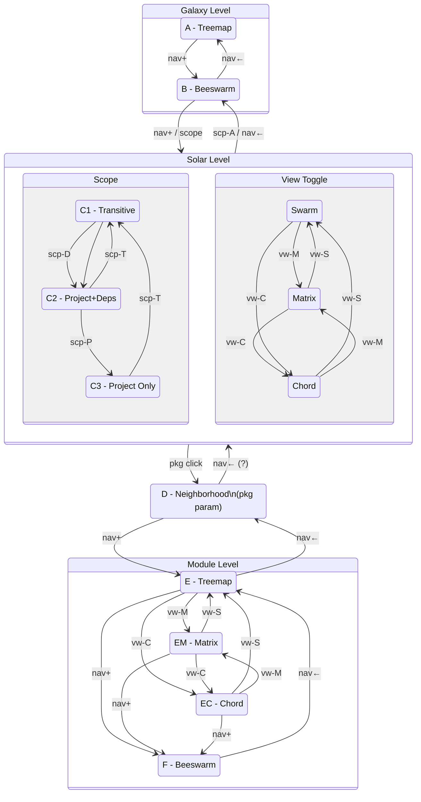
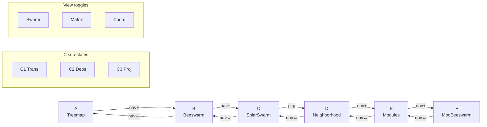
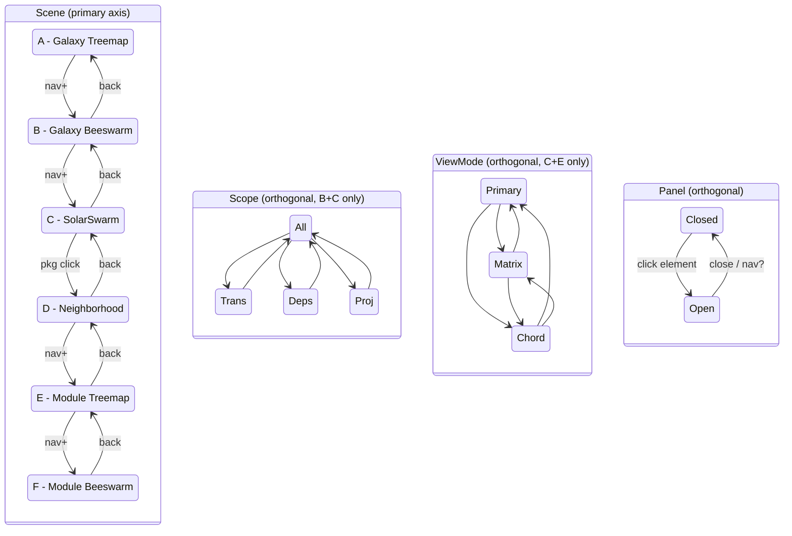

# CE2 State Machine Analysis

## View Naming System

```
GALAXY LEVEL (All 568 packages)
┌──────┬──────────────────┬─────────────────────────────────────────┐
│ Code │ Name             │ Description                             │
├──────┼──────────────────┼─────────────────────────────────────────┤
│ A    │ Galaxy Treemap   │ Blueprint, packages as treemap cells    │
│ B    │ Galaxy Beeswarm  │ Blueprint, packages as circles          │
└──────┴──────────────────┴─────────────────────────────────────────┘

SOLAR LEVEL (Project packages, scope-filtered, beige theme)
┌──────┬──────────────────┬─────────────────────────────────────────┐
│ Code │ Name             │ Description                             │
├──────┼──────────────────┼─────────────────────────────────────────┤
│ C1   │ SolarSwarm Trans │ Bubblepacks, transitive scope           │
│ C1M  │ Trans Matrix     │ Transitive, matrix overlay              │
│ C1C  │ Trans Chord      │ Transitive, chord overlay               │
├──────┼──────────────────┼─────────────────────────────────────────┤
│ C2   │ SolarSwarm Deps  │ Bubblepacks, project+deps scope         │
│ C2M  │ Deps Matrix      │ Project+deps, matrix overlay            │
│ C2C  │ Deps Chord       │ Project+deps, chord overlay             │
├──────┼──────────────────┼─────────────────────────────────────────┤
│ C3   │ SolarSwarm Proj  │ Bubblepacks, project-only scope         │
│ C3M  │ Proj Matrix      │ Project-only, matrix overlay            │
│ C3C  │ Proj Chord       │ Project-only, chord overlay             │
└──────┴──────────────────┴─────────────────────────────────────────┘

NEIGHBORHOOD LEVEL (Single package focus, beige theme)
┌──────┬──────────────────┬─────────────────────────────────────────┐
│ Code │ Name             │ Description                             │
├──────┼──────────────────┼─────────────────────────────────────────┤
│ D    │ Pkg Neighborhood │ Circlepack: deps | focal | dependents   │
└──────┴──────────────────┴─────────────────────────────────────────┘

MODULE LEVEL (Single package's modules, paperwhite theme)
┌──────┬──────────────────┬─────────────────────────────────────────┐
│ Code │ Name             │ Description                             │
├──────┼──────────────────┼─────────────────────────────────────────┤
│ E    │ Module Treemap   │ Modules sized by LOC                    │
│ EM   │ Module Matrix    │ Module import adjacency matrix          │
│ EC   │ Module Chord     │ Module import chord diagram             │
│ F    │ Module Beeswarm  │ Flow overlay on treemap                 │
└──────┴──────────────────┴─────────────────────────────────────────┘

PANEL (Orthogonal state)
┌──────┬──────────────────┬─────────────────────────────────────────┐
│ P    │ Slide-out Panel  │ Module declarations, Pursuit links      │
└──────┴──────────────────┴─────────────────────────────────────────┘
```

---

## Click Transition Matrix

### Clickable Elements Key

| Element | Description |
|---------|-------------|
| pkg | Package (treemap cell / beeswarm circle / bubblepack outer) |
| mod | Module (bubblepack inner / treemap cell / chord arc / matrix cell) |
| scp-A | Scope button → All (568 packages) |
| scp-T | Scope button → Transitive |
| scp-D | Scope button → Project+Deps |
| scp-P | Scope button → Project Only |
| vw-S | View toggle → Swarm/Treemap (primary) |
| vw-M | View toggle → Matrix |
| vw-C | View toggle → Chord |
| nav+ | Forward / + button |
| nav← | Back button |

### Legend

| Symbol | Meaning |
|--------|---------|
| `=` | Stay in current view |
| `-` | Not available |
| `?` | Undefined behavior |
| `→X` | Navigate to view X |
| `+P` | Also opens panel |

---

## Transition Table

```
         │ pkg       │ mod    │ scp-A │ scp-T │ scp-D │ scp-P │ vw-S │ vw-M │ vw-C │ nav+ │ nav←
─────────┼───────────┼────────┼───────┼───────┼───────┼───────┼──────┼──────┼──────┼──────┼──────
A  Tree  │ highlight │ -      │ -     │ -     │ -     │ -     │ -    │ -    │ -    │ →B   │ -
B  Bee   │ →D +P     │ -      │ =     │ →C1   │ →C2   │ →C3   │ -    │ -    │ -    │ →C1  │ →A
─────────┼───────────┼────────┼───────┼───────┼───────┼───────┼──────┼──────┼──────┼──────┼──────
C1 Trans │ →D +P     │ +P     │ →B    │ =     │ →C2   │ →C3   │ =    │ →C1M │ →C1C │ -    │ →B
C1M      │ ?         │ ?      │ →B    │ =     │ →C2M  │ →C3M  │ →C1  │ =    │ →C1C │ -    │ →B
C1C      │ ?         │ ?      │ →B    │ =     │ →C2C  │ →C3C  │ →C1  │ →C1M │ =    │ -    │ →B
─────────┼───────────┼────────┼───────┼───────┼───────┼───────┼──────┼──────┼──────┼──────┼──────
C2 Deps  │ →D +P     │ +P     │ →B    │ →C1   │ =     │ →C3   │ =    │ →C2M │ →C2C │ -    │ →B
C2M      │ ?         │ ?      │ →B    │ →C1M  │ =     │ →C3M  │ →C2  │ =    │ →C2C │ -    │ →B
C2C      │ ?         │ ?      │ →B    │ →C1C  │ =     │ →C3C  │ →C2  │ →C2M │ =    │ -    │ →B
─────────┼───────────┼────────┼───────┼───────┼───────┼───────┼──────┼──────┼──────┼──────┼──────
C3 Proj  │ →D +P     │ +P     │ →B    │ →C1   │ →C2   │ =     │ =    │ →C3M │ →C3C │ -    │ →B
C3M      │ ?         │ ?      │ →B    │ →C1M  │ →C2M  │ =     │ →C3  │ =    │ →C3C │ -    │ →B
C3C      │ ?         │ ?      │ →B    │ →C1C  │ →C2C  │ =     │ →C3  │ →C3M │ =    │ -    │ →B
─────────┼───────────┼────────┼───────┼───────┼───────┼───────┼──────┼──────┼──────┼──────┼──────
D  Neigh │ →D' +P    │ -      │ -     │ -     │ -     │ -     │ -    │ -    │ -    │ →E   │ →C?
─────────┼───────────┼────────┼───────┼───────┼───────┼───────┼──────┼──────┼──────┼──────┼──────
E  Tree  │ -         │ +P     │ -     │ -     │ -     │ -     │ =    │ →EM  │ →EC  │ →F   │ →D
EM       │ -         │ ?      │ -     │ -     │ -     │ -     │ →E   │ =    │ →EC  │ →F   │ →D
EC       │ -         │ ?      │ -     │ -     │ -     │ -     │ →E   │ →EM  │ =    │ →F   │ →D
─────────┼───────────┼────────┼───────┼───────┼───────┼───────┼──────┼──────┼──────┼──────┼──────
F  MBee  │ -         │ +P?    │ -     │ -     │ -     │ -     │ -    │ -    │ -    │ -    │ →E
```

---

## State Space Summary

```
Total Views: 17
  Galaxy:       2  (A, B)
  Solar:        9  (C1-C3 × Swarm/Matrix/Chord)
  Neighborhood: 1  (D, parameterized by package)
  Module:       4  (E, EM, EC, F - parameterized by package)
  Panel:        +2 (open/closed, orthogonal)

State Variables:
  - scene: A | B | C | D | E | F
  - scope: All | Trans | Deps | Proj  (only for B, C)
  - view:  Swarm | Matrix | Chord     (only for C, E)
  - focal: String                     (package name for D, E, F)
  - panel: { open: Bool, module: Maybe String }
```

---

## Open Questions

1. **Back from D** - Return to which C variant? Need to remember "came from" state.

2. **Matrix/Chord clicks** - What should clicking a cell/arc do?
   - Open panel?
   - Highlight related?
   - Navigate?
   - Nothing?

3. **Panel persistence** - Does panel stay open across navigation? Close on scene change?

4. **Event bubbling** - Module click in bubblepack also fires package click. Fix with stopPropagation.

5. **Scope in D?** - Should neighborhood have scope filtering?

---

## Simplification Ideas

1. **Orthogonal state variables** - Instead of 9 C-states, use:
   ```
   { scene: SolarSwarm, scope: Trans|Deps|Proj, view: Swarm|Matrix|Chord }
   ```

2. **Consistent back** - Always go to parent, reset sub-state to defaults.

3. **Panel as pure overlay** - Never affects navigation state.

---

## Navigation Graph (ASCII)

```
        ┌─────┐
        │  A  │ Galaxy Treemap
        └──┬──┘
           │ nav+
           ▼
        ┌─────┐
        │  B  │ Galaxy Beeswarm ◄─── scope-A from C
        └──┬──┘
           │ nav+ / scope-T/D/P
           ▼
    ┌──────────────┐
    │      C       │ Solar Level (9 sub-states)
    │  ┌─────────┐ │
    │  │ scope × │ │◄──── view toggles (M/C)
    │  │  view   │ │
    │  └─────────┘ │
    └──────┬───────┘
           │ pkg click
           ▼
        ┌─────┐
        │  D  │ Neighborhood (parameterized)
        └──┬──┘
           │ nav+
           ▼
    ┌──────────────┐
    │      E       │ Module Level (4 sub-states)
    │  ┌─────────┐ │
    │  │  view   │ │◄──── view toggles (M/C)
    │  └─────────┘ │
    └──────┬───────┘
           │ nav+
           ▼
        ┌─────┐
        │  F  │ Module Beeswarm
        └─────┘
```

---

## Navigation Graph (Mermaid)



### Simplified Linear Flow (Mermaid)



---

## Refactoring Summary

### Current Issues

1. **navStack vs parentScene** - can diverge, causes wrong back navigation
2. **Theme stored + derived** - multiple code paths, potential mismatch
3. **Implicit scope→scene transitions** - SetScope secretly calls NavigateTo
4. **Separate view modes** - moduleViewMode + packageViewMode persist wrongly
5. **Panel state not tracked** - coordinator can't reason about panel
6. **Child state duplication** - children copy Input, can desync

### Target State Model

```
State = {
  scene        : A | B | C | D(pkg) | E(pkg) | F(pkg)
  previousScene: Maybe Scene              -- replaces navStack
  scope        : All | Trans | Deps | Proj   -- only B, C
  viewMode     : Primary | Matrix | Chord    -- only C, E
  panel        : { open, content }           -- tracked here now
  data         : { model, v2, packageSet }   -- from parent
}

Derived (not stored):
  theme = themeForScene(scene)
```

### Key Changes

| Before | After |
|--------|-------|
| `navStack :: Array Scene` | `previousScene :: Maybe Scene` |
| `theme :: ViewTheme` (stored) | `themeForScene scene` (derived) |
| `moduleViewMode` + `packageViewMode` | `viewMode :: ViewMode` (unified) |
| SetScope auto-escalates | SetScope only changes scope |
| Panel has own state | Coordinator tracks panel |
| Children copy Input to State | Children store only handles |

### Clean Transition Rules

```
NavigateTo(s)  → scene=s, viewMode=Primary, previousScene=Just current
NavigateBack   → scene=parentScene(current), previousScene=Just current
SetScope(s)    → scope=s (ONLY scope, no navigation)
SetViewMode(v) → viewMode=v
OpenPanel(c)   → panel.open=true, panel.content=c
ClosePanel     → panel.open=false
```

### Clean State Machine (Mermaid)



---

*Generated 2026-01-25 for CE2 state machine analysis*
